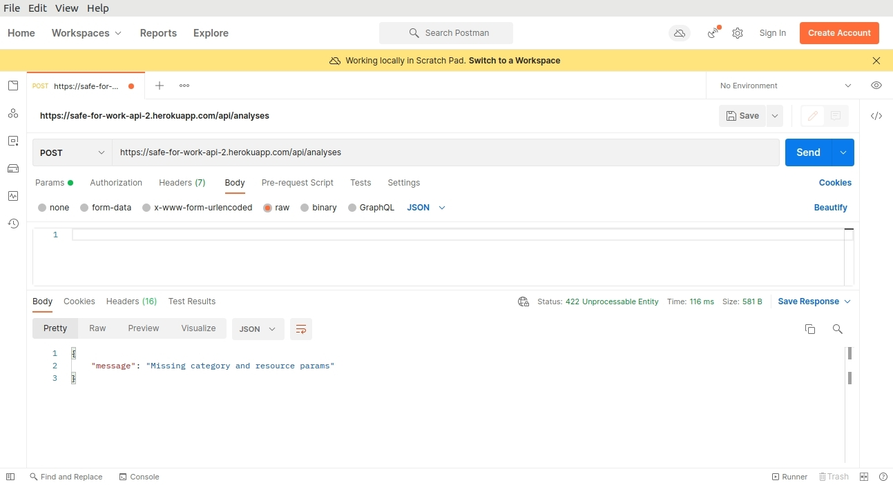
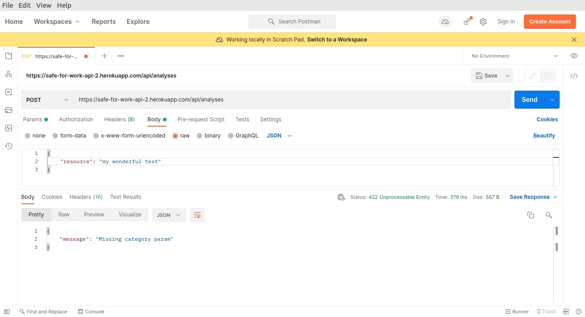
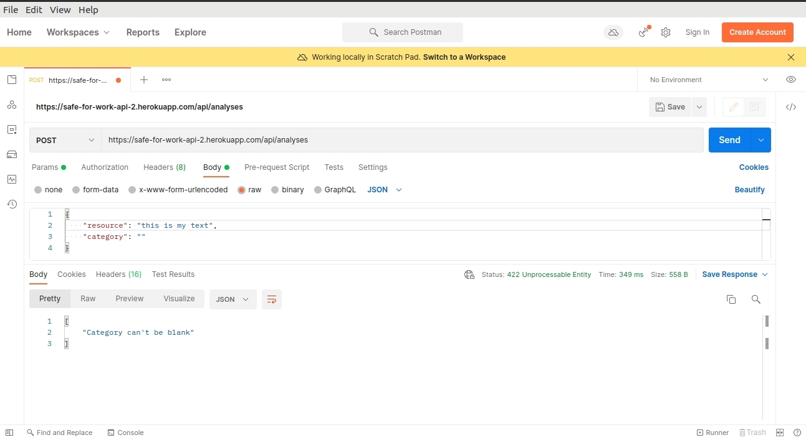
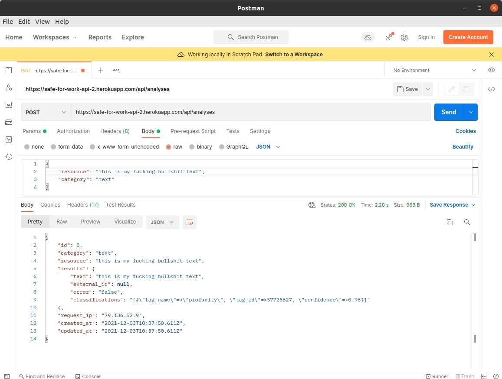
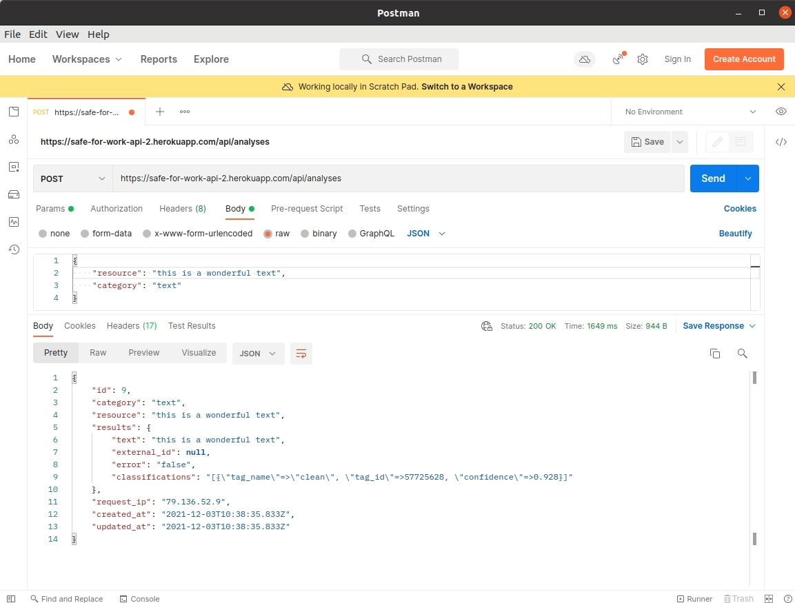
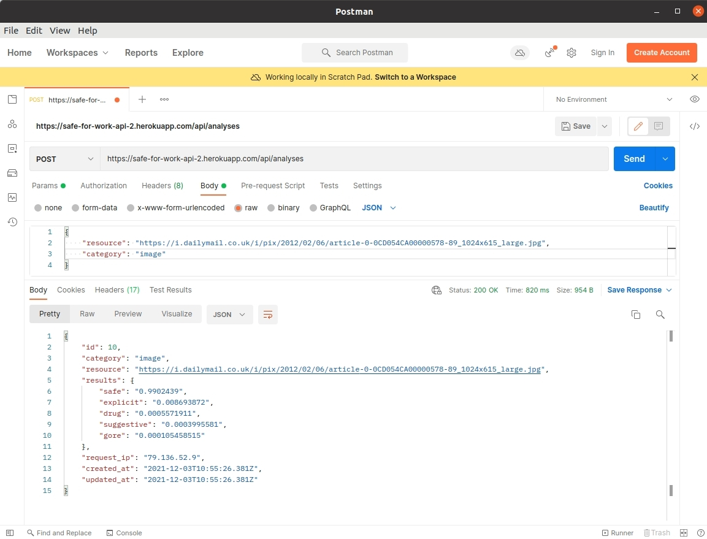
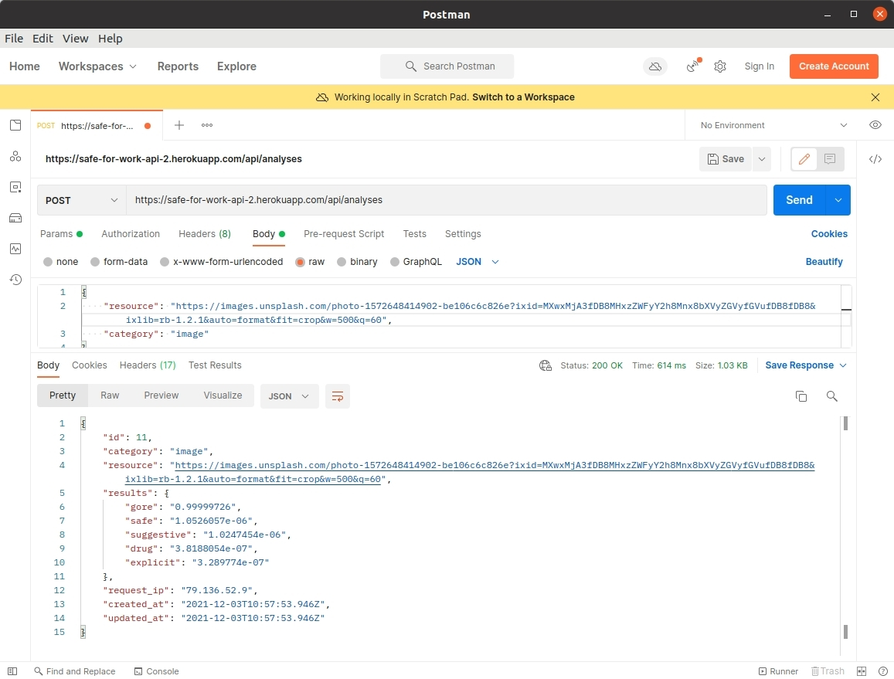

## Moderation API

This API can be used for moderating text and images. It makess use of Clarifai and MonkeyLearn. Two API's that can be used for image and text analysiss respectively.

### Analysis models

IMAGE: https://www.clarifai.com/model-gallery

TEXT: https://monkeylearn.com/blog/public-and-ready-to-use-modules/

# Deployed version

https://safe-for-work-api.herokuapp.com/

### Endpoints

PATH: `/api/analyses`

PARAMETERS

`analysis` Object <`resource`, `category`>

`resource` URL (for `category` `:image`), String (for `category` `:text`)

## Error handling for missing params

When both (category and resource) params are missing

When resource param is missing

When category params is missing

When resource param is empty

When category param is empty

# Samples

## Text analysis

REQUEST: `{"analysis": {"resource": "this is my fucking bullshit text", "category": "text"}}`

RESPONSE:

REQUEST: `{"analysis": {"resource": "You seem like a nice chap, my dear friend!", "category": "text"}}`

RESPONSE:

## Image

REQUEST: `{"analysis": {"resource": "https://i.dailymail.co.uk/i/pix/2012/02/06/article-0-0CD054CA00000578-89_1024x615_large.jpg", "category": "image"}}`

RESPONSE:

REQUEST: `{"analysis": {"resource": "https://images.unsplash.com/photo-1572648414902-be106c6c826e?ixid=MXwxMjA3fDB8MHxzZWFyY2h8Mnx8bXVyZGVyfGVufDB8fDB8&ixlib=rb-1.2.1&auto=format&fit=crop&w=500&q=60", "category": "image"}}`

RESPONSE:

